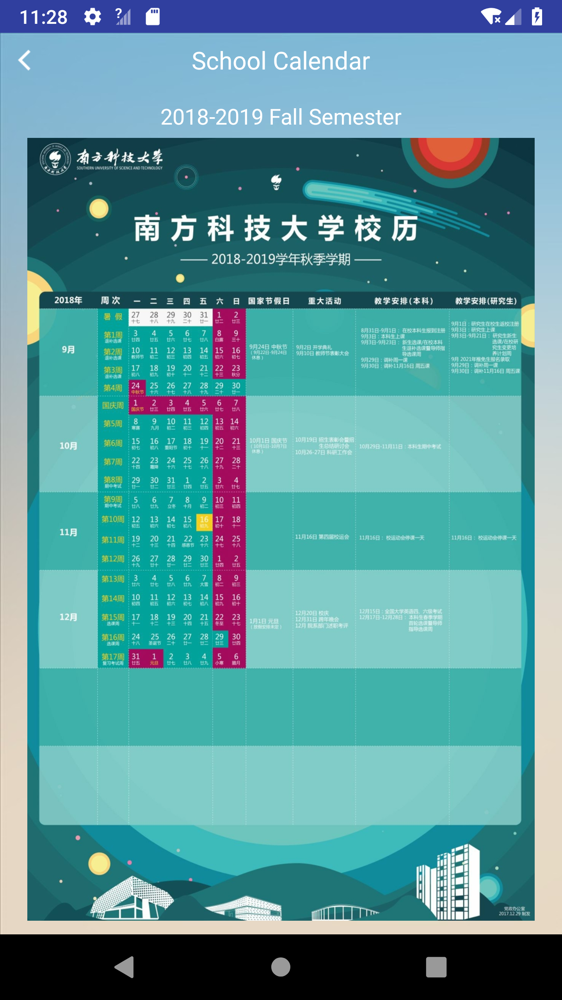

# CS304 Project: Progress Report

### Group name:

HELLO SUSTech

### Members list

- Xu Huang 11612232
- Yutong Wang 11611808
- Kaiming Wu 11611326
- Yifei Xu 11611209
- Zhaoxu Zhang 11611308

### Chosen Feature & Reason

- Sign up for an account with our school email address

  ​    In the future, we want to add the feature of class schedule, which is private and we want it shareable. So, we need to identify each user to make them customize their class schedule, rendering login feature a high priority. Moreover, generating test cases for register is easy but essential so that we want to implement this feature at first.

- Log in

  ​    The reason of choosing sign up is the same as the first feature, that is we need to identify each user. So we need to implement sign up and log in firstly. In addition, register and login are the first two features when users use our app. Besides, using username or mail address should be both acceptable, and this is a challenge for us to deal with the api between back-end and front-end. 

- Check the school calendar

  ​    The reason of choosing this is that this feature is relatively easy to accomplish. The first two features are tough enough, so we want to choose this as the third feature. And this will fullfill the functions of our app.

### Test Scenario

- Sign up for an account with our school email address
  1. When the user inputs a mail address with another mail address postfix rather our school's(e.g. @qq.com), the user will get a notification saying "xxx".

  2. When the user inputs a duplicate username, the user will get a notification saying "xxx".

     

- Log in

  1. If the user inputs his username/mail address, he or she will get a notification saying "xxx" and login successfully.

  2. If the user inputs an incorrect password, he or she will get a notification saying "xxx".

     

- Check the school calendar

  1. If the user wants to open the calender, he or she just click the "school calender" button in the main page.
  2. If the user wants to see the calender of other semasters, the user just right or left slips the screen.

  

### Implementation

- Welcome Page

  

- Entry Page

  

- Main Page

  

- Sign In Page

  

- Sign Up Page

  

- Calendar Page

  

### Future Schedule

| week    | Content                                                 |
| ------- | ------------------------------------------------------- |
| week 10 | Create your owns class table;                           |
| week 11 | Look at the school map;Search school buildings by name; |
| week 12 | Navigate to a location;                                 |
| week 13 | View pictures of a building;                            |
| week 14 | Taking pictures using a camera;                         |
| week 15 | Search school buildings by picture                      |

